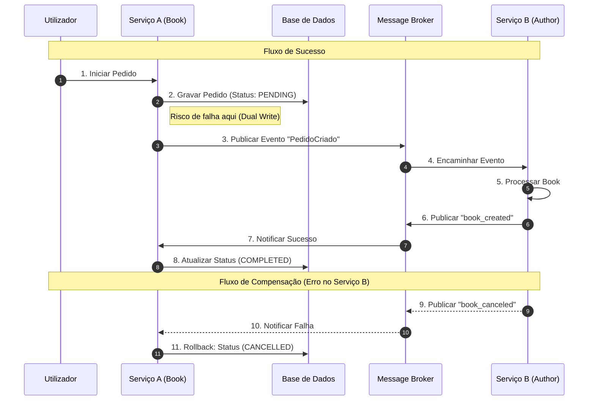

# LMS Books Service

## ArqSoft Requirements

#### Alignment with business requirements

The LMS Books Service is designed to manage book-related operations in a Library Management System (LMS). It provides functionalities such as adding new books, updating book information, deleting books, and retrieving book details. The service aligns with the business requirements of efficiently managing the library's book inventory and ensuring data consistency across multiple instances.

#### ADD-driven design, visual models & alternatives

The service is designed using ADD-driven design principles, with clear visual models representing the architecture and design decisions. Alternatives were considered and documented in the design documentation.

#### Deployment Scalability: Multiple instances per service (VMs or containers)

Using docker-compose, I have created three instances of the books service (books_1, books_2) to demonstrate deployment scalability.

#### Strangler fig

Available in the documentation of the LMS system.

#### Command-Query Responsibility Segregation (CQRS)

We can see it in the code structure, commands and queries are separated.

#### Database-per-Service

Each instance of the service uses its own database (books_1, books_2) to ensure data isolation and independence.

#### Polyglot persistence

I am using PostgreSQL as the database for this service. Try to use cassandra (Non Relational) in the command instance, but my machine cannot handle all docker instances.

#### Messaging through Message Broker (e.g. RabbitMQ)

The service uses RabbitMQ as the message broker for communication between services.

#### Outbox

The service implements the Outbox pattern to ensure reliable message delivery.
When a book is created or updated, the corresponding event is stored in an outbox table within the same transaction as the database operation.
A separate process reads from the outbox table and publishes the events to RabbitMQ.

#### Domain Events

The service publishes domain events to RabbitMQ when significant actions occur, such as when a book is created or updated.

#### Saga

To simplify the implementation, I used a simple local saga pattern using only the books service. In a real-world scenario, the saga would involve multiple services.

#### Change Data Capture (CDC)

The service uses Debezium to capture changes in the PostgreSQL database and publish them to Rabbit

#### Performance/load testing

k6 was used to perform load testing on the service. The tests simulated various scenarios, including high concurrency and large data volumes, to evaluate the service's performance and scalability.

## OdSoft Requirements

#### Static Tests

We develop some tests in the test folder to cover this requirement

#### Unit Tests (SUT = classes, 2 or more classes)

Can be found in test/pt/psoft/gq/pgsoftg1/genremanagement/model/GenreTest

#### Mutation Tests (SUT = domain classes)

Can be found in test/pt/psoft/gq/pgsoftg1/sagamanagement/services/SagaServiceIntegrationTest

#### Consumer-Driven Contract Tests

Can be found int test/java/CDC

#### Container image build

With Dockerfile and Docker-compose files provided.

#### Provision and Hosting (description and argumentation)

Localhost Docker environment for development and testing.

#### Infrastructure as Code (e.g. Dockerfile, Compose, Swarm stack files)

- docker-compose (2 Instances of the service)
- docker-compose-debezium.yml (with Debezium for CDC implementation)
- docker-compose-rabbitmq+postgres.yml (with RabbitMQ and PostgreSQL, rabbitmq to handle messaging between services and postgres as the database)
- docker-compose-swarm.yml (for Docker Swarm deployment)
- docker-compose-traefik.yml (with Traefik as reverse proxy and load balancer)
- Dockerfile (Create image for docker-compose)
- DockerfileWithPackaging (Create image for docker-compose with mvn package included to create jar file)

#### Container image push to Docker repository

Available in the root project

#### Rollout/Deployment (description and argumentation)

The rollout and deployment process for this service leverages Docker Swarm and Traefik for zero-downtime deployments, progressive exposure, and advanced rollout strategies. The provided scripts in the `rollout/` folder automate scaling, traffic shifting, and deployment strategies.

**Canary Deployment:**

- Canary deployment is implemented using Traefik dynamic configuration and the rollout scripts.
- When a new version is deployed, it is initially exposed to a small percentage of users (e.g., 5%) using the canary configuration.
- The rollout/rolloutCanary.sh script is used to automate this process, gradually increasing traffic to the new version while monitoring for errors.
- If no issues are detected, the exposure is increased until all users are using the new version.
- If problems are detected, the rollout can be automatically or manually reverted using the provided scripts.

**Blue/Green and Other Strategies:**

- The rollout/switchBlueGreen.sh script allows switching between blue and green deployments for instant rollback or cutover.
- The rollout/setWeights.sh script can be used to adjust traffic weights or scale services for both command and query instances.

**Example Usage:**

```bash
# Start a canary rollout
cd rollout
./rolloutCanary.sh lmsbooks_command
./rolloutCanary.sh lmsbooks_query

# Switch between blue/green deployments
./switchBlueGreen.sh lmsbooks_command
./switchBlueGreen.sh lmsbooks_query
```

_Replace `lmsbooks_command` and `lmsbooks_query` with your actual service names as defined in your Docker Swarm stack._

#### Deployment to production of service A is automatic

#### Service B deploys only after manual approval following a notification (email or equivalent message)

#### Deploy the system on a remote Docker server (DEI virtual servers or other cloud/remote server)

#### Load tests in staging
The following test are execute in the staging environment using k6:
```bash
  k6 run --vus 100 --duration 30s load-tests/get-books.js
  k6 run --vus 100 --duration 30s load-tests/create-book.js
  k6 run --vus 100 --duration 30s load-tests/mixed-scenario.js
```

#### Scale services via scripts based on load-test results

You can scale services in Docker Swarm using the scripts provided in the `rollout/` folder. These scripts automate scaling, traffic shifting, and deployment strategies.

1. **Manual Scaling Example:**

```bash
# Scale the 'command' (MongoDB) service to 4 replicas
cd rollout
./setWeights.sh lmsbooks_command 4

# Scale the 'query' (PostgreSQL) service to 4 replicas
cd rollout
./setWeights.sh lmsbooks_query 4
```

2. **Automated Scaling Based on Load-Test Results:**

After running your k6 load test, parse the results and trigger scaling if needed:

```bash
k6 run ../load-tests/get-books.js > k6_output.txt
# Example: If average response time > 500ms, scale up 'command' and 'query' services
if grep -q 'http_req_duration.*avg.*[5-9][0-9][0-9]ms' k6_output.txt; then
  cd rollout
  ./setWeights.sh lmsbooks_command 4
  ./setWeights.sh lmsbooks_query 4
fi
```

3. **Other Rollout Scripts:**
- `rollout/activateService.sh` – Activate a service instance
- `rollout/deactivateService.sh` – Deactivate a service instance
- `rollout/switchBlueGreen.sh` – Switch between blue/green deployments
- `rollout/rolloutCanary.sh` – Perform canary rollout
- `rollout/setWeights.sh` – Adjust traffic weights or scale services

#### Smoke tests in dev and staging environments
The same load test executed in dev and staging environments are also used as smoke tests, but with reduced load:
```bash
  k6 run load-tests/smoke/get-books-smoke.js
  k6 run load-tests/smoke/create-book-smoke.js
```

#### Health checks in prod environments
Traefik is configured to perform health checks on the service instances to ensure they are running and responsive.

#### Adopt at least one rollout strategy per student: canary, blue/green or (for groups of 3) or rolling update

Canary deployment using Traefik dynamic configuration.

#### Exposure/Release (description and argumentation)

When a new version of the service is deployed, it is initially exposed to a small percentage of users (e.g., 5%) to monitor its performance and stability. If no issues are detected, the exposure is gradually increased until all users are using the new version.

#### Release gradualy/progressively with zero downtime

Using script in the rollout folder we can easily perform a gradual release with zero downtime by updating the Traefik configuration to route traffic to the new version of the service in increments.

#### Automatically revoke release if tests detect problems

Jenkins pipeline can be configured to automatically roll back the deployment if any issues are detected during the gradual release process.

#### Adopt Dark Launch and Kill Switch release strategies

Traefik can be configured to route traffic based on specific conditions, allowing for dark launches and kill switches.

#### Adopt at least one release strategy per student: Internal/Beta Access, Gradual Release, A/B Testing

In the Traefik configuration, we can set up rules to route a portion of the traffic to the new version of the service (Gradual Release) or to different versions based on user attributes (A/B Testing).

## Running All Tests with Profiles

To run all tests with the different Spring profiles, use the following commands:

```bash
# Run all tests with the 'command' profile (MongoDB)
mvn test -Dspring.profiles.active=command

# Run all tests with the 'query' profile (PostgreSQL)
mvn test -Dspring.profiles.active=query

# Run all tests with the default profile
mvn test
```
